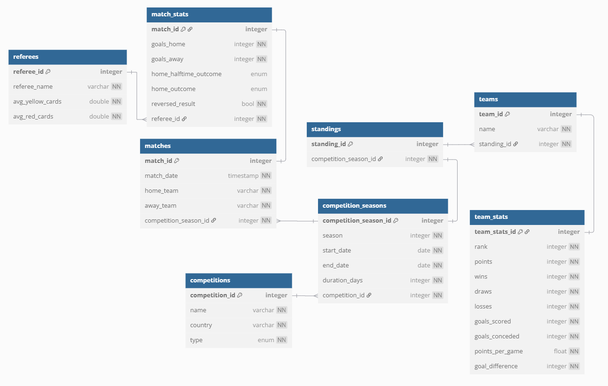

# football-etl

Extracting, Transforming and Loading football data in Python.

## Project Structure

### `main.py`

In main we can launch ETL processes.

### `referees_etl`

- **Extract (E) -** Extracting data from csv file
- **Transform (T) -** Applying transformations to calculate average yellow and red cards between referees in `transform_referees_data` function
- **Load (L) -** Loading the transformed data into a `referees` table in PostgreSQL database (running in Docker) using `load_data_to_referees` function

### `api_sports_etl`

- **Extract (E) -** Extracting data from API endpoints using the functions `fetch_leagues`, `fetch_standings` and `fetch_fixtures`
- **Transform (T) -** Transforming raw data from `.json` files into structured DataFrames, preparing them to loading into the database using functions `transform_leagues`, `transform_standings` and `transform_fixtures`
- **Load (L) -** Loading the transformed data into PostgreSQL database (running in Docker) - Check Database Structure - The data is loaded in a specific order using the following functions: `load_data_to_competitions` -> `load_data_to_competition_seasons` -> `load_data_to_standings` -> `load_data_to_teams` -> `load_data_to_team_stats` -> `load_data_to_matches` -> `load_data_to_match_stats`

## Database Structure

## Setup

### Prerequisites

- Python 3.8+
- PostgreSQL (can be run with Docker)
- Docker and Docker Compose (if using containerized DB)

### Installation

- Create and activate a virtual environment:

python -m venv venv
source venv/bin/activate  # On Windows: venv\Scripts\activate

- Install dependencies:

pip install -r requirements.txt

### Running the ETL

- Make sure the PostgreSQL database is running. Then run:

python main.py

- Make sure to set `API_KEY` from https://www.api-football.com/ in `.env` file.

API_KEY=XXX

